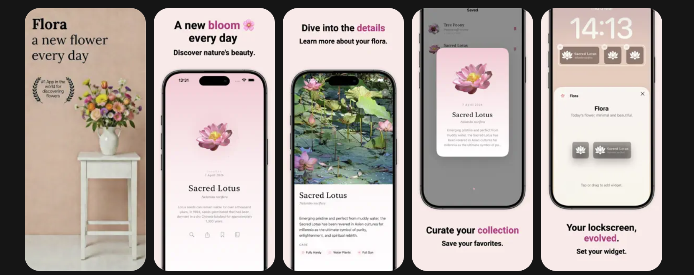
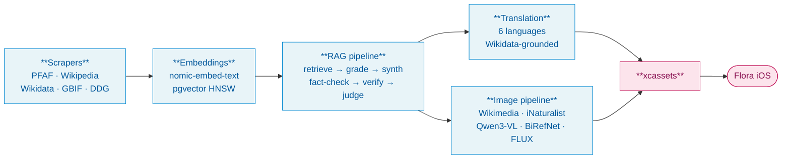
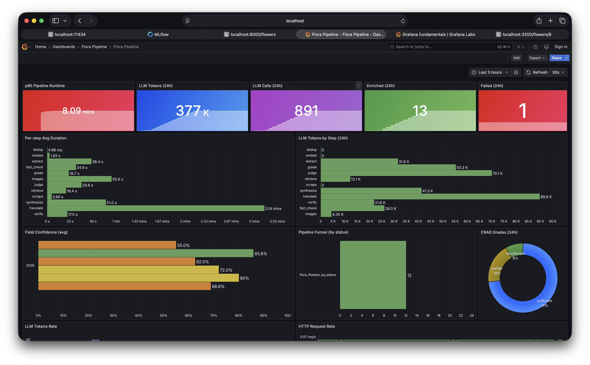
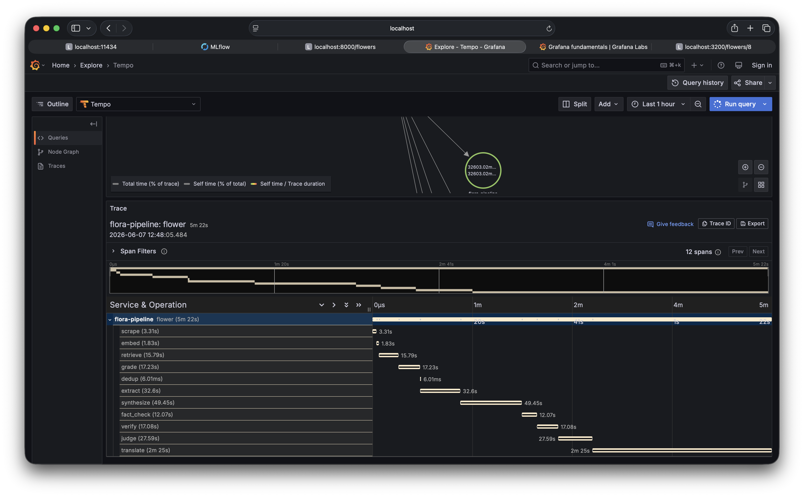
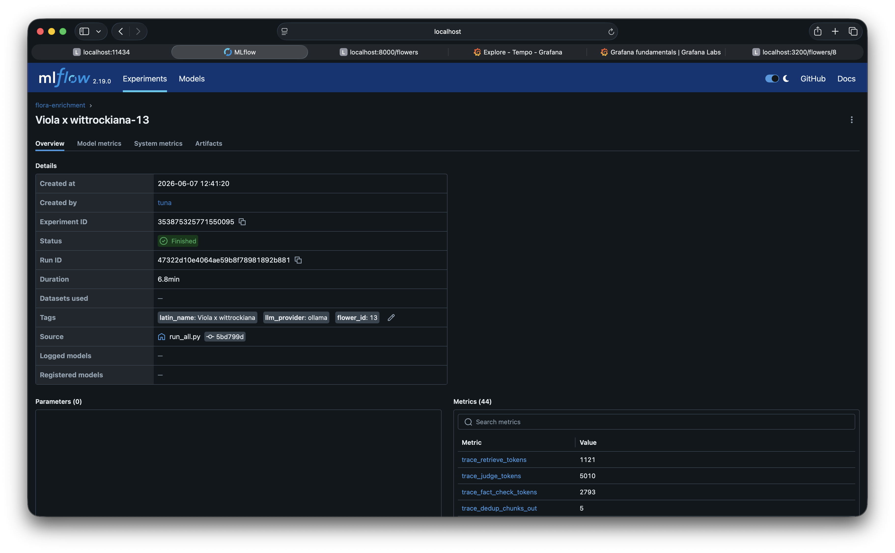

<h1>
  
  Flora Data Pipeline
</h1>

> Botanical data + image pipeline that ships the daily flower into the [Flora iOS app](https://apps.apple.com/ca/app/flora-flower-of-the-day/id6759986494).

[](https://python.org)
[](https://fastapi.tiangolo.com)
[](https://github.com/pgvector/pgvector)
[](https://opentelemetry.io)
[](LICENSE)

<p align="center">
  
</p>

## What & why

Given a plant's scientific name, the pipeline:

1. scrapes five botanical sources,
2. runs a multi-stage RAG pipeline grounded in retrieved context,
3. fact-checks each generated claim against a fresh web snippet,
4. translates into 6 languages with name-field grounding from Wikidata,
5. picks and processes 3 images (info, hero, lock icon),
6. exports an `xcassets` bundle that drops straight into the iOS project.

---

## Architecture



---

## Pipeline stages

| # | Stage | How | Why |
|---|---|---|---|
| 1 | **Scrape** | PFAF (BS4), Wikipedia REST + MediaWiki taxobox, Wikidata SPARQL, GBIF v1, DuckDuckGo. Concurrent, persisted into `raw_sources`. | Each source fills gaps the others leave: PFAF for care data, Wikidata for taxonomy, GBIF for vernacular names, Wikipedia for prose, DDG for the long tail. |
| 2 | **Embed** | `nomic-embed-text` (768d) via Ollama. Recursive chunking on prose sources; single chunk for structured ones. HNSW (m=16, ef=64). | Strongest open embedding model that runs on Ollama. 768d balances recall and storage. |
| 3 | **Per-field retrieve** | SIMPLE fields get one query; COMPLEX fields (etymology, cultural_info, fun_fact) get multi-query + a **HyDE** document. Hybrid **BM25** (Postgres `tsvector` GIN) + **dense** (pgvector cosine), fused by **Reciprocal Rank Fusion**. | BM25 catches rare keyword matches (species names, taxonomy IDs); dense catches paraphrases. RRF fuses both without tuning. HyDE bridges the vocabulary gap on vague fields. |
| 4 | **CRAG grade + correct** | LLM judges chunk relevance per field. Insufficient + COMPLEX → targeted DDG search, in-memory embed/score, re-grade. | Filters irrelevant chunks before synthesis. Web correction rescues coverage when sources lack the answer. |
| 5 | **Dedup + extract** | Pairwise cosine ≥ 0.92 collapses near-duplicates across sources. Fact extraction on COMPLEX fields keeps only verifiable atomic claims. | Cross-source paraphrases would double-weight the same fact in synthesis. |
| 6 | **Synthesize** | Per-field grounded JSON. Each field sees only its own retrieved context, capped at 450 words. Model configurable via `SYNTH_MODEL`. | Per-field isolation prevents one field's sources from contaminating another. |
| 7 | **Web fact-check** | For etymology / cultural_info / fun_fact: targeted DDG search → AGREE/DISAGREE/UNCLEAR verdict from a second LLM → regen with the snippet pinned on disagreement. One regen max. | CRAG checks retrieval quality, not whether the synthesizer used it. Small models override correct context with parametric junk; a post-synthesis snippet check catches that. |
| 8 | **Verify + Judge** | Self-RAG confidence (0–1) weighted by source reliability. **LLM-as-Judge** scores 5 criteria per field (factual_accuracy, completeness, coherence, source_fidelity, engagement); stored in `flowers.confidence_scores`. | Self-RAG asks "is this grounded?"; the judge asks "is this good copy?". Persisted per-field for downstream filtering. |
| 9 | **Translate** | DE/FR/ES/IT/ZH/JA. The `name` field tries Wikidata P1843, then GBIF vernacular names (ISO 639-3 → 639-1 mapped), then a grounded LLM call, falling back to the scientific name. Body fields use the English source pinned in every prompt. | Plant common names are where small LLMs hallucinate confidently. Wikidata and GBIF are authoritative and already cached. Scientific name is the safe fallback. |
| 10 | **Images** | Wikimedia + iNaturalist queried concurrently. Top 4 candidates ranked by **Qwen3-VL-235B** via OpenRouter on fal.ai. Winner → **BiRefNet** background removal (cascades on bad mask). **FLUX Schnell** generates the 200×200 lock icon. | Qwen3-VL ranks botanical photos better than CLIP. BiRefNet handles petal edges cleaner than U²-Net. FLUX Schnell is fast enough for a 200px decorative icon. |
| 11 | **Export** | Writes `flowers.json` + per-flower `.imageset` folders into `output/FlowerAssets.xcassets`. | Complete Xcode asset catalogue. No glue code, drag it into the project. |

---

## Observability

**Stack:** OpenTelemetry, Prometheus, Tempo, Grafana, MLflow, structlog.

A production RAG pipeline must be debuggable. Flora exposes:

- **Traces**: OTel → Tempo (one span per pipeline stage; attributes `chunks_in`, `chunks_out`, `api_calls`, `regenerated`).
- **Metrics**: Prometheus RED counters per stage (`pipeline_duration_s`, `crag_grade_total`, `field_confidence`).
- **Logs**: `structlog` JSON (`latin_name`, `flower_id`, `stage`, `attempt`).
- **Experiments**: MLflow run per flower tagged with provider + model, for A/B comparison over batches.
- **Dashboards**: Grafana correlates traces, metrics, and logs in one UI.

End-to-end on Apple Silicon M4 with `qwen2.5:7b` via Ollama on Metal: about **~7 min per flower**, no API key needed.

<p align="center">
  <br>
  <em>Grafana: a 12-flower batch lands at ~80 min wall time, ~66 LLM calls and ~29 k tokens per flower.</em>
</p>

<p align="center">
  <br>
  <em>Tempo: drilling into one run shows the heavy stages are translate and image; everything else stays well under a minute.</em>
</p>

<p align="center">
  <br>
  <em>MLflow: one run per flower, tagged with provider + model so runs with different configurations are comparable.</em>
</p>

---

## LLM providers and per-step routing

Synthesis wants quality; grading just wants short labels. So each step is wired independently. One `.env`, different models per step.

| Provider | `LLM_PROVIDER` | Notes |
|---|---|---|
| **Ollama** | `ollama` | Local, default. |
| Groq | `groq` | Free tier ~28 RPM, built-in rate limiter. |
| Together.ai | `together` | Same shape as Groq. |
| Gemini | `gemini` | Free tier RPM is tight. |

Per-step config in `.env`:

```bash
SYNTH_MODEL=qwen2.5:7b         # quality matters
TRANSLATION_MODEL=qwen2.5:7b   # multilingual strength matters
FACT_CHECK_MODEL=qwen2.5:7b    # same model verifies its own output's grounding
# GRADE_MODEL, QUERY_GEN_MODEL, JUDGE_MODEL all stay on llama3.2:3b (they only emit short labels)
```

You can squeeze whatever model your hardware fits. Here it's `qwen2.5:7b` for the heavy lifting (best 7B multilingual, native ja/zh) and `llama3.2:3b` for the cheap labelling calls. With more RAM or a paid API, swap up.

---

## Quick start

Pick the LLM provider that fits your situation. Hosted (Groq, Gemini, Together.ai) when you want speed, local Ollama when you want no API key and Metal acceleration. The commands below are for the second case, which is what I run.

```bash
git clone https://github.com/yourusername/Flora-Asset-Pipeline.git
cd Flora-Asset-Pipeline
cp .env.example .env             # set FAL_KEY (optional; image pipeline degrades without it)
uv sync                          # Python deps
ollama pull qwen2.5:7b           # synth/translation model for the local path (~4.7 GB)
docker compose up -d             # Postgres, MLflow, Tempo, Prometheus, Grafana, backend, frontend

uv run python scripts/run_all.py --name "Rosa canina" --skip-images
```

> Ollama runs on the host because Docker can't see Apple's Metal GPU. That costs the one-command setup but gets ~3× the throughput.

Output lands in `output/FlowerAssets.xcassets/`, ready to drop into Xcode. Backend Swagger at [localhost:8000/docs](http://localhost:8000/docs), Grafana at [localhost:3001](http://localhost:3001), MLflow at [localhost:5001](http://localhost:5001).

`run_all.py` flags: `--name`, `--file`, `--limit`, `--skip-images`, `--skip-data`.

---

## Project structure

```
backend/
├── main.py                 FastAPI entrypoint, OTel + Prom wiring
├── config.py               Pydantic settings (per-step provider/model overrides)
├── models.py               Flower, RawSource, SourceEmbedding, Translation
├── routers/                flowers (CRUD + pipeline) · export (xcassets bundle)
├── services/
│   ├── scraper/            pfaf · wikipedia · wikidata · gbif · web_search · orchestrator
│   ├── rag/                chunker · embedder · retriever · deduplicator
│   │                       grader · synthesizer · verifier · judge · fact_checker
│   │                       query_gen · extractor · router
│   ├── llm/                provider · ollama · groq · gemini · together · rate_limiter
│   ├── embeddings/         provider · ollama · openai
│   ├── images/             wikimedia · inaturalist · search · processor · lock_gen
│   ├── translation/        translator (grounded, Wikidata-aware)
│   └── observability.py    OTel + MLflow + Prom wiring
└── tasks/pipeline.py       11-stage orchestrator

frontend/                   Next.js 15 dashboard (status grid, detail, confidence scores)
observability/              Tempo, Prometheus, Grafana configs
scripts/run_all.py          CLI runner (--name, --file, --limit, --skip-data, --skip-images)
```

---

## API

| Endpoint | Method | Purpose |
|---|---|---|
| `/flowers` | GET / POST | List / create |
| `/flowers/{id}` | GET / DELETE | Detail / delete |
| `/flowers/{id}/data` | POST | Run the full RAG pipeline synchronously |
| `/flowers/{id}/images` | POST | Run the image pipeline (requires `enriched` state) |
| `/flowers/{id}/images/{type}` | GET | Serve processed image (`type`: info / main / lock) |
| `/export/...` | various | xcassets bundle build |
| `/health`, `/metrics` | GET | Liveness, Prometheus scrape |

---

## Testing

```bash
uv run pytest tests/ -q            # 62 unit + integration tests
uv run pytest -m integration       # opt-in DB integration tests
```

---

## Design decisions

- **Per-step LLM provider/model overrides.** Synthesis wants quality, grading wants speed. The same env file routes them at different models.
- **Translation grounded in Wikidata first, LLM last.** Plant common names are where small LLMs hallucinate most confidently. Wikidata P1843 and GBIF vernacular names are free, reliable, and already in the DB after step 1.
- **Post-synthesis web fact-check beyond retrieval grading.** CRAG only checks whether the right chunk was retrieved. It doesn't check whether the LLM honoured it. A second pass against a fresh web snippet catches the case where the model overrides good context with parametric junk.
- **LLM-as-Judge sits next to Self-RAG, not in place of it.** Self-RAG answers "is this grounded?"; the judge answers "is this good copy?". Both scores are persisted in `confidence_scores` for downstream filtering.
- **BiRefNet over U²-Net for background removal.** Cleaner masks on complex floral shapes; bad-mask cascade falls back to the next candidate rather than ship a broken hero image.
- **Scientific name as the always-available translation fallback.** Better to show "Tulipa gesneriana" in Japanese than a hallucinated katakana name for a different plant.

---

## License

MIT
